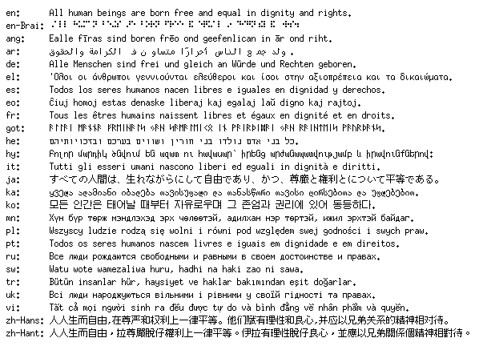

# bitmapfont (v3)

[](https://pkg.go.dev/github.com/hajimehoshi/bitmapfont/v3)

Package `bitmapfont` provides font.Face values of 12px bitmap glyphs.

## API

```go
var Face font.Face
var FaceEA font.Face
var FaceSC font.Face
var FaceSCEA font.Face
var FaceTC font.Face
var FaceTCEA font.Face
```



The `EA` version includes wide glyphs for the characters that have East Asian ambiguous widths (e.g., `※`, `…`, `α`).

The `SC` version prefers simplified Chinese characters.

The `TC` version prefers traditional Chinese characters.

The only real difference between `SC` and `TC` is the position of punctuation marks.

## Sources

 * [Baekmuk Gulim](https://kldp.net/baekmuk/) (Baekmuk License)
 * [Cubic 11](https://github.com/ACh-K/Cubic-11) (OFL-1.1)
 * [misc-fixed](https://www.cl.cam.ac.uk/~mgk25/ucs-fonts.html) (Public Domain)
 * [M+ Bitmap Font](https://mplus-fonts.osdn.jp/mplus-bitmap-fonts/) (M+ Bitmap Fonts License)
 * Arabic glyphs by [@MansourSorosoro](https://twitter.com/MansourSorosoro) (Eternal Dream Arabization) (OFL-1.1)

There is one font face with glyph size 6x13 for halfwidth, and 12x13 for fullwidth so far.

## Baekmuk License

```
Copyright (c) 1986-2002 Kim Jeong-Hwan
All rights reserved.

Permission to use, copy, modify and distribute this font is
hereby granted, provided that both the copyright notice and
this permission notice appear in all copies of the font,
derivative works or modified versions, and that the following
acknowledgement appear in supporting documentation:
    Baekmuk Batang, Baekmuk Dotum, Baekmuk Gulim, and
    Baekmuk Headline are registered trademarks owned by
    Kim Jeong-Hwan.
```

## M+ Bitmap Font License

```
-
M+ BITMAP FONTS            Copyright 2002-2005  COZ <coz@users.sourceforge.jp>
-

LICENSE


These fonts are free softwares.
Unlimited permission is granted to use, copy, and distribute it, with
or without modification, either commercially and noncommercially.
THESE FONTS ARE PROVIDED "AS IS" WITHOUT WARRANTY.
```
